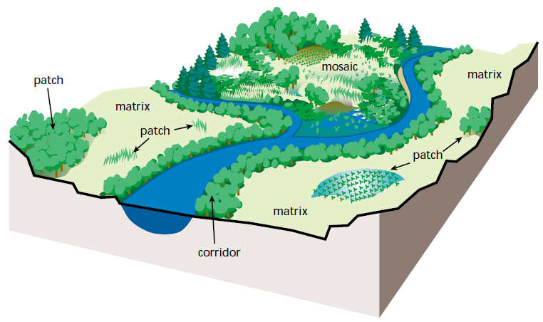

```{r setup, include=FALSE}
knitr::opts_chunk$set(echo = TRUE)
```
&nbsp;
&nbsp;
&nbsp;

&nbsp;
&nbsp;
&nbsp;



\newpage

# Carregando os pacotes necessários para o nosso estudo de métricas da paisagem

Nessa função, os pacotes que já estão instalados em seu computador serão carregados, e aqueles que ainda requerem instalação serão instalados e carreados.

```{r eval=TRUE, echo=TRUE}
# https://gist.github.com/stevenworthington/3178163

ipak <- function(pkg){
  new.pkg <- pkg[!(pkg %in% installed.packages()[, "Package"])]
  if (length(new.pkg)) 
    install.packages(new.pkg, dependencies = TRUE)
  sapply(pkg, require, character.only = TRUE)
}

ipak(c('terra','landscapemetrics','ggplot2'))
```


# Preparando os dados para a análise

Antes de começar a nossa aventura na análise de métricas da paisagem, primeiro faremos uma preparação dos dados de classificação obtidos pelo MapBiomas coleção 8.0. Os dados que utilizaremos aqui estão listados no repositório dentro da pasta **Dados**. Nesse primeiro momento, listaremos os arquivos contidos em nosso diretório. Veremos que os dados são desde 1985 até 2022.

```{r eval=TRUE, echo=TRUE}
dir <- list.dirs("../Dados")
files <- list.files(dir[2], pattern = ".tif")
```

Agora criaremos uma lista para armazenar os dados obtidos pelo MapBiomas. Além disso, rodaremos um código que vai ler cada um dos arquivos e salvar dentro dessa lista.

```{r eval=TRUE, echo=TRUE}
BnoC <- list()

for (i in 1:length(files)) {
  BnoC[[i]] <- rast(paste(dir[2],files[i], sep = "/"))
}; rm(i)
```

Visualisando as classes para o ano de 1985.

```{r eval=TRUE, echo=TRUE}
plot(BnoC[[1]])
```


## Reclassificando a paisagem

Nessa etapa, faremos uma reclassificação dos dados para que seja possível a nossa análise da paisagem. Afinal, quando estamos interessados em uma análise de métricas da paisagem, nem todas as classes de uso e cobertura da terra são de fato necessárias e as classes escolhidas devem estar de acordo com o nosso objetivo e com os requerimentos das espécies estudadas. Nesse exemplo, teremos três classes: (1) natural; (2) antrópico; e (3) água.

Antes de realizar a reclassificação, listei todos os usos em cada um dos anos (1985-2022) e atribuí um valor correspondente de acordo com os objetivos dessa análise.

```{r eval=TRUE, echo=TRUE}
classes_uso <- c(0,3,15,21,4,33,11,12,24,39,25,41,9,20)
classes_paisagem <- c(NA,1,2,2,1,3,1,1,2,2,2,2,2,2)

# Unindo os arquivos em uma matriz
classes <- cbind(classes_uso, classes_paisagem)
```

As classes de uso correspondem às classes originais obtidas pelo MapBiomas e as classes da paisagem são as novas categorias.

Abaixo iremos automatizar essa reclassificação.

```{r eval=TRUE, echo=TRUE}
for (i in 1:length(BnoC)) {
  BnoC[[i]] <- terra::classify(BnoC[[i]],classes)
}
```

Visualisando as novas classes para o ano de 1985.

```{r eval=TRUE, echo=TRUE}
plot(BnoC[[1]])
```

A partir de agora já podemos explorar nossos dados por meio de métricas da paisagem. No entanto, antes faremos uma análise visual sobre as mudanças no uso e cobertura da terra e observar como essas classes  se modificam ao longo do tempo. Observaremos a discrepância entre o ano de 1985 e 2022.

```{r eval=TRUE, echo=TRUE}
par(mfrow = c(1,2))
plot(BnoC[[1]])
plot(BnoC[[38]])
```

# Praticando métricas da paisagem

As métricas da paisagem podem ser analisadas em três níveis diferentes: **mancha**, **classe** e **paisagem**. Cada uma delas respondem perguntas diferentes, mas também podem se complementar e contribuir para uma resposta ecológica mais robusta. 

A análise de métricas em nível de **mancha** pode responder questões em termos de estrutura, tal como área, formato e quantidade, enquanto que em nível de **classe** podemos ver a proporção de cada uma das classes analisadas, dentre outras métricas que retornarão como essas classes estão organizadas. Já em nível de **paisagem**, podemos obter respostas relacionadas a estrutura geral, por exemplo, conectividade. Abaixo veremos alguns exemplos para cada um dos níveis.

\newpage

## Conferindo o status da paisagem

Começaremos a nossa análise de métricas da paisagem conferindo se nossa paisagem está adequada para uso no pacote *landscapemetrics*.

```{r eval=TRUE, echo=TRUE}
check_landscape(BnoC[[38]])
```

Após conferir se a paisagem está de acordo, recebemos a mensagem de que o dado espacializado não está em um sistema de coordenada métrico. Isso indica que precisamos projetar nossa paisagem para um sistema de coordenada que satisfaça os requisitos do pacote. Dentre as opções que temos, as projeções do tipo UTM costumam ser bastante utilizdas. No entanto, ela também possui uma limitação que acontece quando o nosso arquivo do tipo raster está presente em duas ou mais UTMs. Nesse caso precisamos apelar para outro tipo de projeção, tal como Albers.

Abaixo observaremos o sistema de coordenadas atribuído em nossa paisagem.

```{r eval=TRUE, echo=TRUE}
BnoC[[38]]
```

Com isso, a gente consegue observar que o nosso sistema de coordenada está como longitude e latitude WGS 84  (EPSG: 4326). Portanto, iremos projetar as paisagens para o sistema de coordenada UTM. Primeiramente iremos avaliar a zona na em que a nossa paisagem está inserida. 

Abaixo segue  um código simples que retorna o número da zona.

```{r eval=TRUE, echo=TRUE}
# floor((longitude + 180) / 6) + 1
# Aqui substiuiremos os valores mínimos e máximos de longitude na função

floor((-48.83323 + 180) / 6) + 1
floor((-48.64108 + 180) / 6) + 1

```

Com essa função, descobrimos que a nossa paisagem está inserida na zona 22 Sul, visto que a paisagem está localizada no estato de Goiás, Brasil.

Nesse caso, faremos a projeção dos nossos arquivos rasters para a projeção UTM 22 Sul. Caso contrário, se a nossa paisagem estivesse localizada em mais de uma zona, faríamos a projeção para um sistema de coordenada global em metros.

```{r eval=TRUE, echo=TRUE}
newcrs <- "+proj=utm +south +zone=22 +datum=WGS84 +units=m +no_defs"
w = project(BnoC[[1]], newcrs)
w
```

Realizando uma nova conferência em nosso dado. 

```{r eval=TRUE, echo=TRUE}
check_landscape(w)
```

Veremos que ele ainda não atende aos requitos do pacote porque por algum motivo ele modificou a classe para non-integer. Corrigiremos isso utilizando a função round().

```{r eval=TRUE, echo=TRUE}
for (i in 1:length(BnoC)) {
  w <- project(BnoC[[i]], newcrs)
  BnoC[[i]] <- round(w)
}
```

Avaliaremos novamente se o dado atende ao requisito.

```{r eval=TRUE, echo=TRUE}
check_landscape(BnoC[[1]])
```

Pronto! Nosso dado está pronto para ser utilizado no *landscapemetrics*.

\newpage

## Métricas em nível de mancha

### Área da mancha (*lsm_p_area*)

```{r eval=TRUE, echo=TRUE}
area <- lsm_p_area(BnoC[[38]], directions = 8) # 2022
area
```

Vamos observar a diferença no tamanho da área entre as classes. Para isso, faremos um box plot que vai destacar melhor a variação no tamanho das áreas.

```{r eval=TRUE, echo=TRUE}
area <- area[-931,] # removendo ponto discrepante

ggplot(data =  area, 
       aes(x = as.factor(class), 
           y = value, 
           colour = as.factor(class))) +
  geom_boxplot() +
  scale_x_discrete(breaks = c(1,2,3),
                   labels = c("Natural", "Antrópico", "Água")) +
  xlab("Classes") +
  ylab("Área (m²)") +
  theme_bw() + theme(legend.position = "none")
```
```{r eval=TRUE, echo=FALSE}
rm(area)
```


### Porcentagem da área do interior (*lsm_p_cai*)

```{r eval=TRUE, echo=TRUE}
cai <- lsm_p_cai(BnoC[[38]], 
                 directions = 8, 
                 consider_boundary = FALSE, 
                 edge_depth = 1)
cai
```

Nessa análise a variável resposta corresponde a porcentagem de área de interior existe em cada uma das manchas analisadas, sendo 0 a indicação de que mancha é totalmente borda.

```{r eval=TRUE, echo=TRUE}
rm(cai)
```

### Área do interior (*lsm_p_core*)

Essa métrica calcula a área do interior, sendo a área maior que zero. 

```{r eval=TRUE, echo=TRUE}
core <- lsm_p_core(BnoC[[38]],
                   directions = 8,
                   consider_boundary = FALSE,
                   edge_depth = 1)
core
```
A variável resposta está na unidade de medida hectare.

### Circularidade da mancha (*lsm_p_circle*)

Esta métrica é relacionada com o formato da mancha, indicando a circularidade de cada mancha.

```{r eval=TRUE, echo=TRUE}
circle <- lsm_p_circle(BnoC[[38]], directions = 8)
circle
```

Esse índice varia de 0 a 1, sendo 0 manchas completamente circulares e 1 manchas lineares.

### Distância Euclidiana do Vizinho mais Próximo (*lsm_p_enn*)

Essa é uma métrica de agregação, indicando a distância mais próxima entre outra mancha da mesma classe.

```{r eval=TRUE, echo=TRUE}
enm <- lsm_p_enn(BnoC[[38]], directions = 8, verbose = TRUE)
enm
```

A variável resposta está em metros.

### Razão Perímetro-Área (*lsm_p_para*)

```{r eval=TRUE, echo=TRUE}
para <- lsm_p_para(BnoC[[38]], directions = 8)
para
```

Essa análise não possui unidade de medida.

## Métricas em nível de classe

### Índide de agregação (*lsm_c_ai*)

Essa métrica calcula a porcentagem de agregação para cada uma das classes.

```{r eval=TRUE, echo=FALSE}
ai <- lsm_c_ai(BnoC[[38]])
ai
```

### Média do tamanho da área (*lsm_c_area_mn*)

Essa métrica calcula a média do tamanho da área para cada uma das classes.

```{r eval=TRUE, echo=TRUE}
area_mn <- lsm_c_area_mn(BnoC[[38]], directions = 8)
area_mn
```

A variável resposta é em hectare.

### Desvio padrão do tamanho da área (*lsm_c_area_sd*)

Essa métrica calcula o desvio padrão da área de cada mancha.

```{r eval=TRUE, echo=TRUE}
area_sd <- lsm_c_area_sd(BnoC[[38]], directions = 8)
area_sd
```

A variável resposta é em hectare.

### Número de manchas (*lsm_c_np*)

Essa métrica calcuma o número de manchas pertencentes a cada uma das classes.

```{r eval=TRUE, echo=TRUE}
np <- lsm_c_np(BnoC[[38]], directions = 8)
np
```

Vamos brincar um pouco com essa métrica e observar o número de fragmentos ao longo do tempo (1985-2022)

```{r eval=TRUE, echo=TRUE}
dado <- as.data.frame(matrix(data = NA,
                             nrow = length(BnoC), 
                             ncol = 2))

for (i in 1:length(BnoC)) {
  anos <- seq(from = 1985, to = 2022, by = 1)
  np <- lsm_c_np(BnoC[[i]], directions = 8)
  dado[i,1] <- anos[i]
  dado[i,2] <- np[1,6]
}

colnames(dado) <- c("ano","fragmentos")
head(dado)
```

```{r}
ggplot(data = dado, aes(x = ano, y = fragmentos)) +
  geom_line()
```


### Porcentagem da paisagem (*lsm_c_pland*)

Essa métrica calcula a porcentagem de cada uma das classes na paisagem.

```{r eval=TRUE, echo=FALSE}
pland <- lsm_c_pland(BnoC[[38]], directions = 8)
pland
```

## Métricas em nível de paisagem

### Número de manchas (*lsm_l_np*)

Essa métrica calcula a porcentagem de agregação dentro da paisagem.o número de manchas totais na paisagem

```{r}
np <- lsm_l_np(BnoC[[38]], directions = 8)
np
```

### Índice de diversidade de Simpson (*lsm_l_sidi*)

```{r}
sidi <- lsm_l_sidi(BnoC[[38]], directions = 8)
sidi
```

O resultado varia entre 0 e 1, mas não possui unidade de medida.

### Área total da paisagem (*lsm_l_ta*)

Essa métrica calcula a área total da paisagem.

```{r}
ta <- lsm_l_ta(BnoC[[38]], directions = 8)
ta
```

A variável resposta está em hectare.


